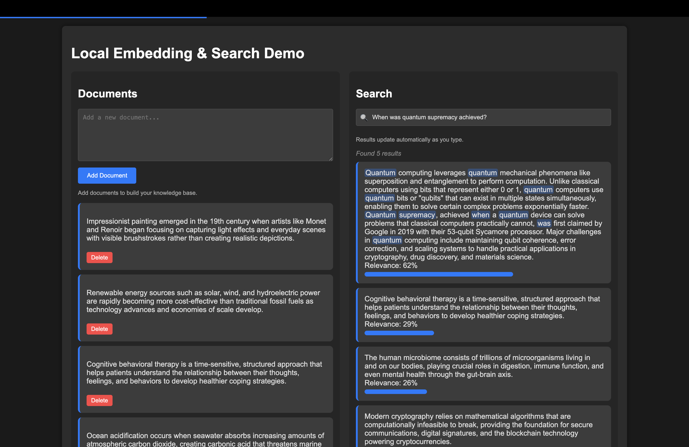

# Browser Vector Search

A lightweight, browser-based semantic search engine that runs entirely client-side without sending data to external servers.



## 🚀 Features

- **100% Client-Side Processing** - All computation happens in your browser
- **Real-Time Semantic Search** - Results update as you type
- **No External API Dependencies** - Works offline after initial model load
- **Instant Document Management** - Add and delete documents with automatic indexing
- **Query Highlighting** - Search terms are highlighted in results
- **Relevance Scoring** - Visual indication of match quality

## 🧠 How It Works

Browser Vector Search uses transformer-based embeddings to perform semantic search without requiring a server:

1. **Embedding Generation** - Converts text to 384-dimensional vectors using MiniLM
2. **Vector Normalization** - Prepares vectors for similarity comparison
3. **Cosine Similarity** - Measures semantic relevance between queries and documents
4. **IndexedDB Storage** - Persists documents and embeddings between sessions
5. **Debounced Search** - Optimizes performance as you type

## 🛠️ Technical Stack

- **ONNX Runtime** - For efficient model inference in browser
- **Transformers.js** - Provides tokenization capabilities
- **IndexedDB** - Browser-based document storage
- **Cloudflare Workers** - Serves static assets and model files
- **Vanilla JavaScript** - No framework dependencies

## 📋 Getting Started

### Prerequisites

- Node.js (for development)
- Wrangler CLI (for Cloudflare deployment)

### Installation

1. Clone the repository:

   ```bash
   git clone https://github.com/vakharwalad23/browser-vecsearch.git
   cd browser-vecsearch
   ```

2. Install dependencies:

   ```bash
   npm install
   ```

3. Start the development server:

   ```bash
   npx wrangler dev
   ```

4. Deploy to Cloudflare:
   ```bash
   npx wrangler deploy
   ```

## 🔍 Usage

1. **Add Documents**:

   - Enter text in the document input field
   - Click "Add Document" to index content

2. **Search**:

   - Type in the search box
   - Results update automatically as you type
   - View relevance scores for each match

3. **Manage Documents**:
   - Delete documents as needed
   - Add new documents at any time

## 🔧 Customization

### Adding Your Own Model

Replace the model URL in [`public/index.html`](public/index.html):

```javascript
const modelUrl = 'https://your-domain.com/your-model.onnx';
```

### Modifying Similarity Calculation

The core similarity function can be adjusted in [`public/index.html`](public/index.html):

```javascript
function cosineSimilarity(a, b) {
	// Customize similarity calculation here
}
```

## 📚 Technical Details

- **Model**: MiniLM-L6-v2 (quantized ONNX format)
- **Vector Size**: 384 dimensions
- **Search Algorithm**: Cosine similarity with normalized vectors
- **Performance Optimizations**:
  - Debounced search (300ms)
  - Batched document processing
  - Normalized vectors for faster comparison
  - Non-blocking UI with progress indicators

## 🔒 Privacy

All processing happens locally in the browser. Your documents and search queries never leave your device (except for the initial model download).

## 📄 License

MIT

## 🙏 Acknowledgements

- Hugging Face Transformers
- ONNX Runtime Web
- Cloudflare Workers

---

Created by Dhruv Vakharwala • https://www.dhruvvakharwala.dev
